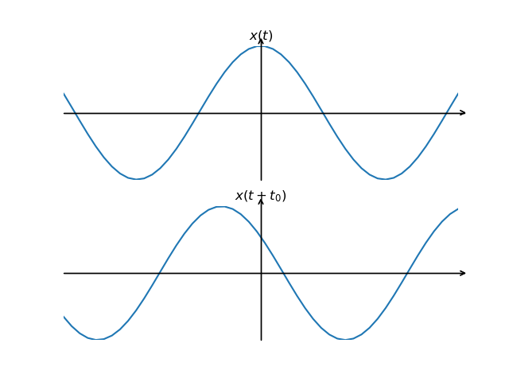

# 第4章 离散时间信号与系统的傅立叶分析
## 4.0 引言 
### 4.0.1 上一章内容概述 
1) 在上一章中，我们将连续时间信号用复指数信号est的线性组合来表示，由此引入了一种新的信号与系统分析方法——频域分析
2) 该分析方法先将信号或系统响应通过傅立叶变换得到其频域特性，最后将频域分析结果再通过变换，得到最终时域结果
3)  通过上两章内容，我们已经知道，信号与系统的分析方法有时域和频域两种分析方法
4)	本章主要分析对象是离散时间信号和系统，具体方法跟上一章类似，只是要重点关注离散系统和连续系统不一致之处
### 4.0.2 本章目标 
1)	离散信号用复指数信号的表示
2)	离散傅立叶级数
3)	离散傅立叶变换（非周期信号、周期信号）
4)	离散傅立叶变换的性质
5)  离散信号与系统的频域分析

## 4.1 离散时间LTI系统对复指数信号的响应 
### 4.1.1 上一章概念 
1)	LTI系统对于对复指数信号的响应也是同样一个复指数信号，只是在幅度上有点变化，即，${\it e}^{st} \to {\mit H}(s){\it e}^{st}$，H(s)一般是s的函数
2)	一个信号，若系统对该信号的输出响应仅是一个常数乘以该输入，则该信号称为系统的*特征函数*，而幅度因子H(s)称为*特征值*。
### 4.1.2 本章应用 
1)	对于离散时间系统来说，$x[n]=z^{\it n}$ 就是一个特征函数，证明如下：
$$y[n]=h[n]*x[n]=\sum_{k=-\infty}^{+\infty} h[k]x[n-k]=\sum_{k=-\infty}^{+\infty} h[k]z^{n-k}=z^n\sum_{k=-\infty}^{+\infty} h[k]z^{-k}={\mit H}(z)z^n$$
 
2) 任何复指数函数$z^n$就是离散LTI系统的特征函数，$${\mit H}(z)=\sum_{k=-\infty}^{+\infty} h[k]z^{-k}$$ 就是跟$z^n$有关的特征值
3)	对于信号 $x[n]=a_1z_1^n+a_2z_2^n+a_3z_3^n$，系统对于每个分量的响应分别是：

    $a_1z_1^n \to a_1{\mit H}(z_1)z_1^n$

    $a_2z_2^n \to a_2{\mit H}(z_2)z_2^n$

    $a_3z_3^n \to a_3{\mit H}(z_3)z_3^n$
 
4)	那么根据LTI系统的叠加性，有$y[n]=a_1{\mit H}(z_1)z_1^n+a_2{\mit H}(z_2)z_2^n+a_3{\mit H}(z_3)z_3^n$ 
5)	更一般的情况是$$\sum_{k} a_kz_k^n \to \sum_{k} a_k{\mit H}(z^k)z_k^n$$ ，由此可见，对于一个离散LTI系统而言，如果我们得知各个特征值$H_(zk)$，那么系统对于一个由复指数函数线性组合构成的输入的响应就可以直接求得。
6)	接下来的问题是：

    a)	离散信号如何用复指数的线性组合来表示；
7)	本章仅讨论z=^{\it jw} 的情况，也即|z|=1 的z^n 信号，更一般的情况，我们在Z变换中介绍
## 4.2 周期信号的表示：离散时间傅立叶级数 
### 4.2.1 成谐波关系复指数信号的线性组合 
1)	跟连续时间信号相似，对于周期为N的离散时间信号x[n]，可以表示成一组谐波复指数信号的线性组合
2)	一组谐波信号$\phi_k[n]={\it e}^{jk(2\pi/N)n}$ ，k=0,$\pm$1,$\pm$2...... ，跟连续时间信号最重要的不同，在连续域，该组信号有无数个不同信号，但是在离散域，改组信号仅由N个信号是不同的，也即，对于k=k+N，信号则是完全相同的。当k在相继N个整数上取值时，$\phi_k$ 不同，否则就有信号重复出现
3)	同样的，周期离散信号可以用傅立叶级数表示，但只有不同的N项。
4)	傅立叶级数表示形式：$$x[n]=\sum_{k=\langle N \rangle} a_k\phi_k[n]=\sum_{k=\langle N \rangle} a_k{\it e}^{jk(2\pi/N)n}......(1)$$ ，这个就是x[n]的离散时间傅立叶级数表示，ak就是傅立叶级数的系数，一般k我们取0—N-1
### 4.2.2 周期信号傅立叶级数表示的确定 
1)	跟连续时间系统的推导类似，我们先可以证明 
$$\sum_{k=0}^{N-1} {\it e}^{jk(2\pi/N)n}=\begin{cases} N,& \text{$\pm$1,$\pm$N,......} \\ 0, & \text{其它k值} \end{cases} $$
2)	在（1）式两边各乘以${\it e}^{-jr(2\pi/N)n}$ ，然后在连续N项上求和，再利用上式，我们可以得到傅立叶级数系数的计算公式为：$$a_k= \frac{1}{N}\sum_{k=\langle N \rangle} x[n]{\it e}^{-jk(2\pi/N)n}$$
3)	所以周期离散傅立叶信号的*分析*公式为： $$x[n]=\sum_{k=\langle N \rangle} a_k{\it e}^{jk(2\pi/N)n}$$
4)	周期离散傅立叶信号的*综合*公式为:$$a_k= \frac{1}{N}\sum_{k=\langle N \rangle} x[n]{\it e}^{-jk(2\pi/N)n}$$ 
5)	傅立叶级数系数$a_k$我们也叫做频谱系数
6)	根据上面公式，我们有$a_k=a_k+N$.
### 4.2.3 几个例子 
1)	例1：求$x[n]=sinΩ_0n$傅立叶级数的系数

    a)	解：根据已学知识，我们知道x[n]是不是周期函数有一个判定条件，$2π/Ω_0$如果是整数或者有理数，则x[n]是周期函数；若是无理数，则不是周期函数。

    b)	所以求傅立叶级数的系数只有在x[n]是周期函数情况下有意义

    c)	当$2π/Ω_0=N$时，即$Ω_0=2π/N$，$$x[n]=\frac{1}{2j}{\it e}^{j(2\pi/N)n}-\frac{1}{2j}{\it e}^{-j(2\pi/N)n}$$ ，所以傅立叶级数的系数为$a_1=1/2j$，$a_{-1}=-1/2j$，其余系数均为0

    d)	当$2π/Ω_0=m/N$时，我们假设两者没有公因子，且m<N，否则令m=m%N即可，$Ω_0=2πm/N$，此时 ，所以傅立叶级数的系数为$a_m=1/2j$，$a_{-m}=-1/2j$

    e)	以N＝5为例，第一种情况，傅立叶级数为如图所示，画出示意图（同奥本海默第一版P230图5.2）；第二种情况，傅立叶级数如图所示，（同奥本海默第一版P230图5.3）
2)	例2：求信号$$x[n]=1+\sin(\frac{2\pi}{N})n+3\cos(\frac{2\pi}{N})n+cos(\frac{4\pi}{N}n+\frac{\pi}{2})$$ 傅立叶级数的系数，N>=5。

    a)	解： $$x[n]=1+\frac{1}{2j}[{\it e}^{j(2\pi/N)n}-{\it e}^{-j(2\pi/N)n}]+\frac{3}{2}[{\it e}^{j(2\pi/N)n}+{\it e}^{-j(2\pi/N)n}]+\frac{1}{2}[{\it e}^{j(4\pi n/N+\pi/2)}+{\it e}^{-j(4\pi n/N+\pi/2)}]$$ $$=1+(\frac{3}{2}+\frac{1}{2j}){\it e}^{j(2\pi/N)n}+(\frac{3}{2}-\frac{1}{2j}){\it e}^{-j(2\pi/N)n}+(\frac{1}{2}{\it e}^{j\pi/2}){\it e}^{j2(2\pi/N)n}+(\frac{1}{2}{\it e}^{-j\pi/2}){\it e}^{-j2(2\pi/N)n}$$
 
 
    b)	所以有$a_0=1,a_1=\frac{3}{2}-\frac{1}{2}j,a_{-1}=\frac{3}{2}+\frac{1}{2}j,a_2=\frac{1}{2}j,a_{-2}=-\frac{1}{2}j$ ，其余系数均为0

    c)	上述系数的实部虚部表示（奥本海默第一版P231图5.4a）

    d)	上述系数的模幅角表示（奥本海默第一版P231图5.4b）

3)	例3：求周期函数x[n]傅立叶级数的系数。$$x[n]=x[n+N].x[n]=\lbrace  1, -N_1 \leq n \leq N_1 \\
0, N_1<|n|<N$$

    a)	解：用公式得，$$a_k=\frac{1}{N}\sum_{n=\langle N \rangle} {\it e}^{-jk(2\pi/N)n}=\frac{1}{N}\sum_{n=\langle -N_1 \rangle}^{N_1} {\it e}^{-jk(2\pi/N)n}$$

    b)	当k＝0时，$a_k=(2N_1+1)/N$，否则

    c)	做变量替换，$m=n+N_1$，有$$a_k=\frac{1}{N}\sum_{m=0}^{2N_1} {\it e}^{-jk(2\pi/N)(m-N_1)}=\frac{1}{N}{\it e}^{jk2\pi N_1/N}\sum_{m=0_1}^{2N_1} {\it e}^{-jk(2\pi/N)m}=\frac{1}{N}{\it e}^{jk2\pi N_1/N}\frac{1-{\it e}^{-jk(2\pi/N)(2N_1+1)}}{1-{\it e}^{-jk2\pi /N}}$$ $$=\frac{1}{N} \frac{{\it e}^{-jk\frac{2\pi}{2N}}({\it e}^{jk\frac{2\pi}{2N}(2N_1+1)}-{\it e}^{-jk\frac{2\pi}{2N}(2N_1+1)})}{{\it e}^{-jk\frac{2\pi}{2N}}({\it e}^{jk\frac{2\pi}{2N}}-{\it e}^{-jk\frac{2\pi}{2N}})}=\frac{1}{N} \frac{\sin(2k\pi \frac{N_1+1/2}{N})}{\sin(\frac{2k\pi}{N})}$$
    
 
 
 
    d)	则$$N_{a_k}=\frac{\sin(2k\pi \frac{N_1+1/2}{N})}{\sin(\frac{2k\pi}{N})}$$ ，当N固定时，$N_{a_k}$的包络是相同的，唯一不同是分布密度。（附图：奥本海默第一版P233图5.6，也可以看教材，应该也有）

    e)	注意：该包络也是周期函数，这是同连续傅立叶变换不同的地方.

    f)	通过该图，我们也可知，信号可以被完全恢复出来，而不是像连续信号一样，有吉伯斯现象

    g)	所以，离散周期信号全部能够用傅立叶级数表示，不需要像连续域那样必须满足狄里赫利条件

## 4.3 非周期信号的表示：离散时间傅立叶变换 
### 4.3.1 非周期信号如何表示（基本思路）
1)	根据上节推导，离散周期时间信号可以用傅立叶级数来表示，那么离散非周期信号呢？
2)	跟连续时间相同，离散时间非周期信号x(t)可以看成是周期信号$\tilde{x}(t)$ 的一个周期，当$\tilde{x}(t)$ 的周期变成无穷大时，$\tilde{x}(t)$ 就是x(t)
3)	这样我们可以利用周期信号的研究结果来研究非周期信号
### 4.3.2 离散傅立叶变换对的推导 
1)	考虑一个非周期序列x[n]，它有有限持续期。也即对于一个整数$N_1$，当 $|n|> N_1$时，有x[n]=0，如下图所示。(奥本海默第一版P236图5.8)

2)	将x[n]进行周期延拓，得到信号$\tilde{x}[n]$ ，周期为N，$N≥2N_1+1$，当$|n|\leq N_1$ 时，有 $\tilde{x}[n]$=x[n]
3)	根据上节介绍，我们可以将$\tilde{x}[n]$ 表示成傅立叶级数形式，有$$\begin{cases} \tilde{x}[n]=\sum_{k=\langle N \rangle} a_k{\it e}^{jk(2\pi/N)n}...(1)\\
a_k=\frac{1}{N}\sum_{k=\langle N \rangle} \tilde{x}[n]{\it e}{-jk(2\pi/N)n}...(2)\end{cases}$$
 
4)	在 $|n|\leq N_1$范围内，有$\tilde{x}[n]$ =x[n]，而当$|n|> N_1$ 时，x[n]=0，所以有$$a_k=\frac{1}{N}\sum_{k=\langle N \rangle} \tilde{x}[n]{\it e}{-jk(2\pi/N)n}=\frac{1}{N}\sum_{k=-N_1}^{N-1} x[n]{\it e}{-jk(2\pi/N)n}=\frac{1}{N}\sum_{k=-\infty}^{\infty} x[n]{\it e}{-jk(2\pi/N)n}$$
 
5)	我们定义$$X({\it e}^{j\omega})=\sum_{n=-\infty}^{+\infty} x[n]{\it e}^{-j\omega n}$$ ，则$N_{a_k}$ 就是 $X({\it e}^{j\omega})$在$\omega=k(2\pi/N) $处的采样，即$$a_k=\frac{1}{N}X({\it e}^{jk\frac{2\pi}{N}})=\frac{1}{N}X({\it e}^{jk\omega})...(3) $$，其中$\omega_0=2\pi/N$ 为信号$\tilde{x}[n]$ 的基波周期
6)	接下来我们考虑用$X({\it e}^{j\omega})$ 来表示x[n]
7)	将上面$a_k$ 表达式(3)代入到（1）式，有$$\tilde{x}[n]=\sum_{k=\langle N \rangle} \frac{1}{N}X({\it e}^{jk\omega_0}){\it e}^{jk\omega_0 n}=\frac{1}{2\pi} \sum_{k=\langle N \rangle} X({\it e}^{jk\omega_0}){\it e}^{jk\omega_0 n}\omega_0 ...(4)$$

8)	当$N \to \infty$时，有 $\omega \to 0$，$$\lim_{N \to \infty} \tilde{x}[n]=x[n] $$，则上式(4)变成$$x[n]=\frac{1}{2\pi}\int_? X({\it e}^{j\omega}){\it e}^{j\omega n} \ {\rm d}\omega$$
 ，接下来我们要确定积分范围
9)	根据（4）式，k的取值范围是在一个周期内，不放先取[0,N-1]，则积分变量 的取值范围为[0,(N-1)  ]，即[0，(N-1)2π/N]，当N∞时，积分范围为[0,2π]，当k取值范围在一个连续N范围内时，积分范围也在一个连续2π内，所以有$$x[n]=\frac{1}{2\pi}\int_{2\pi} X({\it e}^{j\omega}){\it e}^{j\omega n} \ {\rm d}\omega$$
 
10)	综上，有$$\lbrace x[n]=\frac{1}{2\pi}\int_{2\pi} X({\it e}^{j\omega}){\it e}^{j\omega n} \ {\rm d}\omega...(5) \\ X({\it e}^{j\omega})=\sum_{n=-\infty}^{+\infty} x[n]{\it e}^{-j\omega n}...(6)$$ ，（5）为综合公式，（6）为分析公式，这是一个傅立叶变换对。$X({\it e}^{j\omega})$ 叫信号x[n]的频谱。

### 4.3.3 连续时间和离散时间傅立叶变换的异同  
1)	连续时间傅立叶变换$$X(j\omega)=\int_{-\infty}^{+\infty} {x(t){\it e}^{-j\omega t}} \ {\rm d}t$$ 一般来说是连续非周期信号
2)	离散时间傅立叶变换$$X({\it e}^{j\omega})=\sum_{n=-\infty}^{+\infty} x[n]{\it e}^{-j\omega n}$$ 则是一个周期为2π的连续信号

 
### 4.3.4 几个例子
1)	例1：求信号$x[n]=a^n u[n],|a|<1$的频谱。

    a)	解：$$X({\it e}^{j\omega})=\sum_{n=-\infty}^{+\infty} x[n]{\it e}^{-j\omega n}=\sum_{n=0}^{=\infty} a^n{\it e}^{-j\omega n}=\sum_{n=0}^{+\infty} (a{\it e}^{-j\omega})^n=\frac{1-(a{\it e}^{-j\omega})^\infty}{1-a{\it e}^{-j\omega}}=\frac{1}{1-a{\it e}^{-j\omega}}$$
 
    b)	 $$|X({\it e}^{j\omega})|=\mid \frac{1}{1-a\cos \omega +j(a\sin \omega)} \mid=\frac{1}{\sqrt{1+a^2-2a\cos\omega}}$$，周期为2π

    c)	$$\angle X({\it e}^{j\omega})={\rm arctg}(\frac{-a\sin \omega}{1-a\cos \omega})$$ ，周期为2π
2)	例2：求信号x[n]的频谱。$$x[n]=a_{|n|},|a|<1 $$

    a)	解： $$X({\it e}^{j\omega})=\sum_{n=-\infty}^{+\infty} x[n]{\it e}^{-j\omega n}=\sum_{n=0}^{=\infty} a^n{\it e}^{-j\omega n}+\sum_{n=-\infty}^{-1} a^{-n}{\it e}^{-j\omega n}=\sum_{n=0}^{+\infty} (a{\it e}^{-j\omega})^n+\sum_{n=-\infty}^{0} (a{\it e}^{j\omega})^{-n}-1$$ $$=\frac{1-(a{\it e}^{j\omega})^\infty}{1-a{\it e}^{-j\omega}}+\frac{1-(a{\it e}^{j\omega})^\infty}{1-a{\it e}^{j\omega}}-1=\frac{1}{1-a{\it e}^{-j\omega}}+\frac{1}{1-a{\it e}^{j\omega}}-1=\frac{1-a^2}{1-2a\cos \omega +a^2}$$
 
 
    b)	频谱是实数，如图所示（奥本海默第一版P239图5.12）

3)	例3：求矩形脉冲序列x[n]的频谱。$$x[n]=\lbrace 1,|n|\leq N_1 \\ 0,|n|>N_1$$

    a)	解： $$X({\it e}^{j\omega})=\sum_{n=-\infty}^{+\infty} x[n]{\it e}^{-j\omega n}=\sum_{n=-{N_1}}^{N_1} {\it e}^{-j\omega n}=\sum_{n=0}^{2N_1} {\it e}^{-j\omega (n-N_1)}={\it e}^{j\omega N_1}\frac{1-({\it e}^{-j\omega})^{2N_1+1}}{1-{\it e}^{-j\omega}}$$

    b)	 $$=\frac{{\it e}^{j\omega N_1}{\it e}^{-j\omega(N_1+\frac{1}{2})}({\it e}^{j\omega(N_1+\frac{1}{2})}-{\it e}^{-j\omega(N_1+\frac{1}{2})})}{{\it e}^{-j\omega/2}({\it e}^{j\omega/2}-{\it e}^{-j\omega/2})}=\frac{\sin(\omega(N_1+\frac{1}{2}))}{\sin(\omega/2)}$$

    c)	注意，上式也是以2π为周期的频谱，如图所示(奥本海默第一版P240图5.13)

4)	例4：求单位脉冲序列x[n]=δ[n]的傅立叶变换。

    a)	解：$$X({\it e}^{j\omega})=\sum_{n=-\infty}^{+\infty} x[n]{\it e}^{-j\omega n}=1$$ 

## 4.4 周期信号与离散时间傅立叶变换 
### 4.4.1 问题的导出 
1)	例1：求下列周期冲激串$\tilde{x}[n]$ 的傅立叶变换。$$\tilde{x}[n]=\sum_{k=-\infty}^{+\infty} \delta[n-kN]$$ ，如下图所示(奥本海默第一版P242图5.15)

2)	如果用上节的方法，有$$X({\it e}^{j\omega})=\sum_{n=-\infty}^{+\infty} x[n]{\it e}^{-j\omega n}=\sum_{n=-\infty}^{+\infty} [(\sum_{k=-\infty}^{+\infty} \delta[n-kN]){\it e}^{-j\omega n}]$$ ，既要算内层，又要算外层，有点复杂
3)	例2：求信号x[n]的频谱。$x[n]={\it e}^{j\omega_0 n}$ ，其中$2\pi / \omega_0$ 为有理数
a)	解：$$X({\it e}^{j\omega})=\sum_{n=-\infty}^{+\infty} x[n]{\it e}^{-j\omega n}=\sum_{n=-\infty}^{+\infty} [{\it e}^{j\omega_0 n}{\it e}^{-j\omega n}=\sum_{n=-\infty}^{+\infty} [{\it e}^{j(\omega_0-\omega)n}]$$ ，下面也很难计算
4)	那么离散周期信号的傅立叶变换怎么求呢？

### 4.4.2 周期信号的傅立叶变换 
1)	考查上例2和傅立叶反变换公式$$x[n]=\frac{1}{2\pi}\int_{2\pi} X({\it e}^{j\omega}){\it e}^{j\omega n} \ {\rm d}\omega$$ ，若令 $$X({\it e}^{j\omega})=\sum_{n=-\infty}^{+\infty} 2\pi\delta(\omega-\omega_0-2\pi l)$$ ，则在任意一个2π区间内对$ X({\it e}^{j\omega})$ 利用上面反变换公式，可得$x[n]={\it e}^{j\omega_0 n}$ ，所以周期信号x[n]的傅立叶变换为上式所代表的信号，如下图所示。(奥本海默第一版P243图5.16)

2)	顺便说一下，上面x[n]中如果$2\pi/\omega$ 为无理数，其对应的傅立叶变换也是如此。
3)	我们再继续进行扩展，如果有$x[n]=b_1{\it e}^{j\omega_1 n}+b_2{\it e}^{j\omega_2 n}+...+b_M{\it e}^{j\omega_M n}$ ，则对应的傅立叶变换为  $$X({\it e}^{j\omega})=b_1\sum_{n=-\infty}^{+\infty} 2\pi\delta(\omega-\omega_1-2\pi l)+b_2\sum_{n=-\infty}^{+\infty} 2\pi\delta(\omega-\omega_2-2\pi l)+...+b_M\sum_{n=-\infty}^{+\infty} 2\pi\delta(\omega-\omega_M-2\pi l)$$
 
4)	那么对于周期信号x[n]可以用傅立叶级数表示为 $$x[n]=\sum_{k=\langle N \rangle} a_k{\it e}^{jk(2\pi/N)n}$$
5)	我们将上述求和范围确定为[0,N-1]，所以有$x[n]=a_0+a_1{\it e}^{j(2\pi/N)n}+a_2{\it e}^{j_2(2\pi/N)n}+...+a_{N_1}{\it e}^{j_{(N-1)}(2\pi/N)n}$
 
6)	对应傅立叶变换为： $$X({\it e}^{j\omega})=a_0\sum_{n=-\infty}^{+\infty} 2\pi\delta(\omega-2\pi l)+a_1\sum_{n=-\infty}^{+\infty} 2\pi\delta({\omega-2\pi}/{N-2\pi l})+...+a_{N-1}\sum_{n=-\infty}^{+\infty} 2\pi\delta(\omega-(N-1)\frac{2\pi}{N}-2\pi l)$$
 
7)	我们观察上式，希望能够得出一个更紧凑的形式
8)	将上式每个求和均展开，我们观察l均取－1，0和1时的三种情况，有
9) $$X({\it e}^{j\omega})=a_0 2\pi \delta(\omega+2\pi)+a_1 2\pi \delta(\omega-\frac{2\pi}{N}+2\pi)+...+a_{N-1} 2\pi \delta(\omega-(N-1)\frac{2\pi}{N}+2\pi)$$ $$+a_0 2\pi \delta(\omega)+a_1 2\pi \delta(\omega-\frac{2\pi}{N})+...+a_{N-1} 2\pi \delta(\omega-(N-1)\frac{2\pi}{N})$$ $$+a_0 2\pi \delta(\omega-2\pi)+a_1 2\pi \delta(\omega-\frac{2\pi}{N}-2\pi)+...+a_{N-1} 2\pi \delta(\omega-(N-1)\frac{2\pi}{N}-2\pi)$$	 
 
 
10)	根据傅立叶级数系数的特性，有$a_0=a_N=a_{-N}$，因为其也具有周期性
11)	我们观察当$l=1$时的$a_0$项$a_0 2\pi \delta(\omega-2\pi)$ ，也可以写成$$a_N 2\pi \delta(\omega-N\frac{2\pi}{N})$$ ，其他项也是一样
12)	这样的话我们可以得到一个通项，$$a_k 2\pi \delta(\omega-k\frac{2\pi}{N})$$ ，所以可以将傅立叶变换写成$$X({\it e}^{j\omega})=\sum_{}^{+\infty} 2\pi a_k \delta(\omega-k\frac{2\pi}{N})$$
 
13)	前面第一种叫形式一，这种更紧凑的叫形式二，本质上是一样的。在以后做题过程中，如果遇到x[n]傅立叶级数系数N项均为非零的话，用形式二，否则用形式一。

### 4.4.3 两个例子 
1)	例1：求下列周期冲激串$\tilde{x}[n]$ 的傅立叶变换。$$\tilde{x}[n]=\sum_{k=-\infty}{+\infty} \delta[n-kN]$$

    a)	解：首先得到该信号的傅立叶级数的系数，$$x[n]=\sum_{k=-\infty}^{+\infty}a_k{\it e}^{jk(2\pi/N)n} $$，a_k=1/N ，

    b)	所以傅立叶级数为 $$X({\it e}^{j\omega})=\sum_{}^{+\infty} 2\pi a_k \delta(\omega-\frac{2\pi k}{N})=\frac{2\pi}{N}\sum_{k=-\infty}^{+\infty} \delta(\omega-\frac{2\pi k}{N})$$

    2)	例2：求$x[n]=\cos(\omega_0 n)$ 的傅立叶变换。

    a)	解： $$x[n]=\frac{1}{2}{\it e}^{j\omega_0 n}+\frac{1}{2}{\it e}^{-j\omega_0 n}$$

    b)	所以有：  $$X({\it e}^{j\omega})=\sum_{}^{+\infty} \pi\lbrace\delta(\omega-\omega_0-2\pi l)+\delta(\omega-\omega_0-2\pi l)\rbrace$$

## 4.5 离散时间傅立叶变换的性质 
离散时间傅立叶变换的性质及其推导方法基本上同连续时间傅立叶变换性质。
### 4.5.1 周期性 
1)	离散时间信号的傅立叶变换$X({\it e}^{j\omega})$ 是周期的，周期为2π，这个上面已经说明
### 4.5.2 线性性质 
1)	若 $$x_1[n] \leftrightarrow X_1({\it e}^{j\omega})$$,$$x_2[n] \leftrightarrow X_2({\it e}^{j\omega})$$，则 $$ax_1[n]+bx_2[n] \leftrightarrow aX_1({\it e}^{j\omega})+bX_2({\it e}^{j\omega})$$
### 4.5.3 对称性 
1)	若x[n]是某一实数序列，则有$X^*({\it e}^{j\omega})=X({\it e}^{-j\omega})$ ，共轭对称性
2)	由此可以得出：$R_e\lbrace X({\it e}^{j\omega})\rbrace$ 是w的偶函数， 是w的奇函数
3)	证明： $$X^*({\it e}^{j\omega})=(\sum_{n=-\infty}^{+\infty} x[n]{\it e}^{-j\omega n})^\ast=\sum_{n=-\infty}^{+\infty} x[n]^\ast {\it e}^{j\omega n}=c {\it e}^{j\omega n}=X({\it e}^{-j\omega})$$
4)	根据共轭性质，我们就可以知道$X({\it e}^{j\omega})$ 的实部就是偶函数，奇部就是奇函数。
5)	推论：如果x[n]是实且偶的，那么其傅立叶变换也是实偶的；如果x[n]是奇且实的，则其傅立叶变换是奇且纯虚的。

### 4.5.4 时移和频移性质 
1)	若$x[n] \leftrightarrow X({\it e}^{j\omega})$ ，则有$$ x[n-n_0] \leftrightarrow {\it e}^{-j\omega n_0} X({\it e}^{j\omega})$$ 和$$ {\it e}^{-j\omega_0 n}x[n] \leftrightarrow X({\it e}^{j(\omega-\omega_0)})$$
2)	证明： $$\sum_{n=-\infty}^{+\infty} x[n-n_0]{\it e}^{-j\omega n}=\sum_{n=-\infty}^{+\infty} x[l]{\it e}^{-j\omega (l+n_0)}={\it e}^{-j\omega n_0} \sum_{n=-\infty}^{+\infty} x[l]{\it e}^{-j\omega l}={\it e}^{-j\omega n_0} X({\it e}^{j\omega})$$
3)	同理，同学可以自己证明：$$\frac{1}{2\pi}\int_{2\pi} X({\it e}^{j(\omega-\omega_0)}) {\it e}^{j\omega n} \ {\rm d}\omega=\frac{1}{2\pi}\int_{0}^{2\pi} X({\it e}^{j\omega}){\it e}^{j(\omega-\omega_0)n} \ {\rm d}\omega=\frac{1}{2\pi}\int_{-\omega_0}^{2\pi-\omega_0} X({\it e}^{j\omega}){\it e}^{j(\omega+\omega_0)n} \ {\rm d}\omega$$
 
 

### 4.5.5 差分与求和 
1)	离散时间的求和相当于连续时间的积分，离散时间的差分相当于连续时间的微分，因此此处也有类似的结论
2)	若$x[n] \leftrightarrow X({\it e}^{j\omega})$ ，则$x[n]-x[n-1] \leftrightarrow (1-{\it e}^{-j\omega})X({\it e}^{j\omega})$ ，这个用上面的时移性质直接可以得到
3)	那么x[n]求和后的信号其傅立叶变换如何求？
令$$y[n]=\sum_{k=-\infty}^{n} x[k]$$ ，显然$x[n]=y[n]-y[n-1]$ ，看起差分是求和的逆系统。所以两者的单位脉冲响应卷积和应该为单位脉冲响应δ[n]，根据卷积定理，两者的傅立叶变换之积应该为1，所以信号求和的傅立叶变换应该为：$$ \sum_{k=-\infty}^{n} x[k] \leftrightarrow \frac{1}{1-{\it e}^{-j\omega}} X({\it e}^{j\omega})$$
4)	但是实际上除了这些还不够，正确的应该是：$$\sum_{k=-\infty}^{n} x[k] \leftrightarrow \frac{1}{1-{\it e}^{-j\omega}} X({\it e}^{j\omega})+\pi X(0)\sum_{k=-\infty}^{+\infty} \delta (\omega-2\pi k)$$
 
5)	作为其一种特例，若x[n]=δ[n]，对应  $X({\it e}^{j\omega})=1$，则$$\sum_{k=-\infty}^{n} x[k] $$，所以有$$u[n] \leftrightarrow \frac{1}{1-{\it e}^{-j\omega}}+\pi X(0)\sum_{k=-\infty}^{+\infty} \delta (\omega-2\pi k)$$
 
6)	整个的推导方法完全类似于连续时间积分性质的推导，有兴趣的同学可以去试着推导一遍
7)	推导方法：

    a)	利用δ[n]=u[n]-u[n-1]的关系，推导出$$F\lbrace u[n] \rbrace=\frac{1}{1-{\it e}^{-j\omega}}+g({\it e}^{j\omega})$$ 的形式，其中 $g({\it e}^{j\omega})$只有在$\omega=0$,$\pm 2\pi$,$\pm 4\pi$ 时非零

    b)	设y[n]=Od{u[n]}，证明y[n]有如下形式y[n]=u[n]+a+bδ[n]，其中a和b是待确定的常数。

    c)	利用F{y[n]}必然是纯虚数这一点，推导出  $$g({\it e}^{j\omega})=\pi \sum_{k=-\infty}^{+\infty} \delta (\omega-2\pi k)$$

    d)	利用上a)-c)结果和卷积性质，证明：$$F\lbrace \sum_{k=-\infty}^{n} x[k] \rbrace=\frac{1}{1-{\it e}^{-j\omega}} X({\it e}^{j\omega})++\pi X(0)\sum_{k=-\infty}^{+\infty} \delta (\omega-2\pi k)$$
 

### 4.5.6 时间和频率尺度特性 
1)	若 $x[n] \leftrightarrow X({\it e}^{j\omega})$，则有$x[-n]=X({\it e}^{-j\omega})$ ，
A)	证明：$$\sum_{n=-\infty}^{+\infty} x[n]{\it e}^{-j\omega n}=\sum_{m=+\infty}^{+=-\infty} x[m]{\it e}^{-j(-\omega) n} X({\it e}^{-j\omega})$$
2)	缩放的话，跟连续信号有所不同；

    A)	连续信号有$$x(at) \leftrightarrow \frac{1}{|a|}X(\frac{\omega}{a})$$ ，但是在离散域则不是这样，如x[2n]就是将x[n]的偶次样本拿出来所构成，其实已经损失了x[n]的若干信息

    B)	类似的结果有：如果定义$$x_{(k)}[n]=\begin{cases} x[n/k],n是k的倍数 \\ 0,n不是k的倍数 \end{cases}$$ ，这里k是正整数

    C)	当k=3时的实例如图所示（奥本海默第一版P250图5.20）

    D)	对应的傅立叶变换为 $$ X_{(k)}({\it e}^{j\omega})=\sum_{n=-\infty}^{+\infty} x_{(k)}[n]{\it e}^{-j\omega n}=\sum_{r=-\infty}^{+\infty} x_{(k)}[rk]{\it e}^{-j\omega rk}=\sum_{r=-\infty}^{+\infty} x[r]{\it e}^{-j(k\omega) n}=X({\it e}^{jk\omega})$$

    E)	 

    F)	也即时域展宽，则频域收缩。

### 4.5.7 频域微分 
1)	若$x[n] \leftrightarrow X({\it e}^{j\omega})$ ，则有 $$nx[n] \leftrightarrow j\frac{dX({\it e}^{j\omega})}{d\omega}$$
2)	证明：

    a)	由已知，有$$X({\it e}^{j\omega})=\sum_{n=-\infty}^{+\infty} x[n]{\it e}^{-j\omega n}$$ ，两边对ω求导，得$$\frac{dX({\it e}^{j\omega})}{d\omega}=-\sum_{n=-\infty}^{+\infty} jnx[n]{\it e}^{-j\omega n}$$
 
    b)	两边乘以j，有$$j\frac{dX({\it e}^{j\omega})}{d\omega}=\sum_{n=-\infty}^{+\infty} nx[n]{\it e}^{-j\omega n} $$

    c)	也即 $$nx[n] \leftrightarrow j\frac{dX({\it e}^{j\omega})}{d\omega}$$

### 4.5.8 帕斯瓦尔定理 
1)	定理：信号能量可以用能量密度谱积分得到，即 $$\sum_{n=-\infty}^{+\infty} {|x[n]|}^2=\frac{1}{2\pi}\int_{2\pi} {|X({\it e}^{j\omega})|}^2 \ {\rm d}\omega$$
2)	证明：$$\sum_{n=-\infty}^{+\infty} {|x[n]|}^2=\sum_{n=-\infty}^{+\infty} x[n] \cdot x^*[n]=\sum_{n=-\infty}^{+\infty}  \lbrace x[n](\frac{1}{2\pi}\int_{2\pi} X({\it e}^{j\omega}) {\it e}^{j\omega n} \ {\rm d}\omega)^\ast \rbrace$$ 
3)	 $$=\sum_{n=-\infty}^{+\infty}  \lbrace x[n]\frac{1}{2\pi}\int_{2\pi} X^\ast({\it e}^{j\omega}) {\it e}^{-j\omega n} \ {\rm d}\omega \rbrace$$
4)	交换积分和求和顺序，得$$\frac{1}{2\pi}\int_{2\pi} X^\ast({\it e}^{j\omega}) \lbrace \sum_{n=-\infty}^{+\infty} x[n]{\it e}^{-j\omega n} \rbrace \ {\rm d}\omega=\frac{1}{2\pi}\int_{2\pi} X^\ast({\it e}^{j\omega})X({\it e}^{j\omega}) \ {\rm d}\omega=\frac{1}{2\pi}\int_{2\pi} {|X({\it e}^{j\omega})|}^2 \ {\rm d}\omega$$
 
5)	同理可得：对于周期信号，在一个周期内信号能量跟傅立叶级数之间的关系为$$\frac{1}{N}\sum_{n=\langle N \rangle} {|x[n]|}^2=\sum_{n=\langle N \rangle} {|a_k|}^2$$
 

### 4.5.9 几个综合例子 
1.	例1：
2.	例2：
3.	例3：

## 4.6 卷积性质 
1)	卷积性质：$x[n] \leftrightarrow X({\it e}^{j\omega})$ ，$h[n] \leftrightarrow H({\it e}^{j\omega})$ ，则 $y[n]=x[n]*h[n]=X({\it e}^{j\omega})H({\it e}^{j\omega})$
2)	也即：$y[n]=x[n]*h[n]$ ，$Y({\it e}^{j\omega})=X({\it e}^{j\omega})H({\it e}^{j\omega}) $
3)	H({\it e}^{j\omega}) 称为系统的频率响应
4)	证明完全类似连续信号卷积性质的推导，此处略
5)	例1：已知系统单位脉冲响应为$h[n]=\delta[n-n_0]$ ，则响应频率响应为：

    a)	$$ H({\it e}^{j\omega})=\sum_{n=-\infty}{+\infty} \delta[n-n_0]{\it e}^{-j\omega n_0}={\it e}^{-j\omega n_0}$$

    b)	若系统输入x[n]的频谱为 $X({\it e}^{j\omega})$，则通过该系统为输出为 ${\it e}^{-j\omega n_0}X({\it e}^{j\omega})$，幅度不发生变化，只发生相移，也即只是延迟了一段时间（$n_0）。
6)	例2：已知 $h[n]=\alpha^nu[n]$，$x[n]=\beta^nu[n]$ ，$|\alpha|<1$,$|\beta|$求y[n]

    a)	解：这个可以通过时域方法解，在这里我们用用频域方法

    b)	需要先求出$Y({\it e}^{j\omega})$ ，然后作反变换即可

    c)	$$H({\it e}^{j\omega})=\sum_{n=-\infty}{+\infty} h[n]{\it e}^{-j\omega n_0}=\sum_{n=-\infty}{+\infty} \alpha^n{\it e}^{-j\omega n_0}=\frac{1}{1-\alpha{\it e}^{-j\omega}}$$ ，同理 $$X({\it e}^{j\omega})=\frac{1}{1-\beta{\it e}^{-j\omega}}$$

    d)	所以根据卷积定理，有 $$Y({\it e}^{j\omega})=X({\it e}^{j\omega})H({\it e}^{j\omega})=\frac{1}{1-\alpha{\it e}^{-j\omega}}\frac{1}{1-\beta{\it e}^{-j\omega}}$$

    e)	接下来要根据 $Y({\it e}^{j\omega})$求出y[n]

    f)	若α≠β，则$$Y({\it e}^{j\omega})=\frac{A}{1-\alpha{\it e}^{-j\omega}}+\frac{B}{1-\beta{\it e}^{-j\omega}}$$ ，可得 
    $$
    \begin{cases}
    A+B=1 \\
    -A\beta-B\alpha=0
    \end{cases}
    $$

    g)	所以有
    $$
    \begin{cases}
    A=\frac{\alpha}{\alpha-\beta} \\
    B=\frac{-\beta}{\alpha-\beta}
    \end{cases}
    $$ 
    ，由上面推导，可得 
    $$
    y[n]=\frac{\alpha}{\alpha-\beta} \alpha^nu[n]-\frac{\beta}{\alpha-\beta} \alpha^nu[n]=\frac{1}{\alpha-\beta}[\alpha^{n+1}u[n]-\beta^{n+1}u[n]]
    $$

    h)	 

    i)	若α＝β，则
    $$
    Y({\it e}^{j\omega})=(\frac{1}{1-\alpha{\it e}^{-j\omega}})^2
    $$
     ，其对应的y[n]怎么求呢？

    j)	$$
     Y({\it e}^{j\omega})=(\frac{1}{1-\alpha{\it e}^{-j\omega}})^2=\frac{j}{\alpha} {\it e}^{j\omega} \frac{d}{d\omega}(\frac{1}{1-\alpha{\it e}^{-j\omega}})
     $$

    k)	根据前面的微分性质，我们有 
    $$
    nx[n] \leftrightarrow j\frac{dX({\it e}^{j\omega})}{d\omega}
    $$，加上
    $$
    \alpha^n u[n] \leftrightarrow = \frac{1}{1-\alpha{\it e}^{-j\omega}}
    $$，可得
    $$
     n\alpha^n u[n] \leftrightarrow = j\frac{d}{d\omega}(\frac{1}{1-\alpha{\it e}^{-j\omega}})
     ...(1)
     $$

    l)	再根据时移性质 
    $$
    x[n-n_0] \leftrightarrow {\it e}^{-j\omega n_0}X({\it e}^{j\omega})
    $$
    ，去$n_0$＝－1，应用于(1)就有：

    m)	$$
    (n+1)\alpha^{n+1} u[n+1] \leftrightarrow = j{\it e}^{j\omega}\frac{d}{d\omega}(\frac{1}{1-\alpha{\it e}^{-j\omega}}) 
    $$

    n)	上式两边除以α得：
    $$
    (n+1)\alpha^n u[n+1] \leftrightarrow = \frac{j}{\alpha}{\it e}^{j\omega}\frac{d}{d\omega}(\frac{1}{1-\alpha{\it e}^{-j\omega}})= \frac{1}({1-\alpha{\it e}^{-j\omega}})^2
    $$
 

    o)	所以有
    $
    y[n]=(n+1)\alpha^n u[n+1]=(n+1)\alpha^n u[n]
    $ ，因为n=-1时值为1

## 4.7 调制性质 
1)	前面说了时域卷积对应频域相乘，那么时域相乘对应频域又是如何呢？
2)	若 
$
x_1[n] \leftrightarrow X_1({\it e}^{j\omega})，x_2[n] \leftrightarrow X_2({\it e}^{j\omega}) ，则
$$
y[n]=x_1[n]x_2[n] \leftrightarrow \frac{1}{2\pi}\int_{2\pi} X_1({\it e}^{j\theta})X_2({\it e}^{j(\omega-\theta)}) \ {\rm d}\theta
$$
 
3)	证明：
$$
Y({\it e}^{j\omega})=\sum_{n=-\infty}^{+\infty} y[n]{\it e}^{-j\omega n}=\sum_{n=-\infty}^{+\infty} x_1[n]x_2[n]{\it e}^{-j\omega n} =\sum_{n=-\infty}^{+\infty} x_2[n]\lbrace \frac{1}{2\pi}\int_{2\pi} X_1({\it e}^{j\theta}){\it e}^{j(\omega-\theta)} \ {\rm d}\theta \rbrace {\it e}^{-j\omega n}$$ $$=\frac{1}{2\pi}\int_{2\pi} X_1({\it e}^{j\theta})[\sum_{n=-\infty}^{+\infty} x_2[n]{\it e}^{-j(\omega-\theta)n}] \ {\rm d}\theta=\frac{1}{2\pi}\int_{2\pi} X_1({\it e}^{j\theta})X_2({\it e}^{j(\omega-\theta)}) \ {\rm d}\theta
$$
4)	 
5)	 

## 4.8 傅立叶变换与傅立叶级数的性质及基本傅立叶变换对列表 
具体见课本P149-P152
## 4.9 对偶性 
### 4.9.1 离散时间傅立叶级数
1)	对于离散周期信号，其傅立叶级数的系数也是周期的。
2)	我们可以把傅立叶级数的系数也看成是周期信号，那么其对应的傅立叶级数的系数是多少呢？
3)	先看看傅立叶级数系数的相关公式：

    a)	综合公式： 
    $$
    x[n]=\sum_{\langle N \rangle} a_k{\it e}^{jk(2\pi/N)n}
    $$

    b)	分析公式： 
    $$
    a_k=\frac{1}{N}\sum_{\langle N \rangle} x[n]{\it e}^{-jk(2\pi/N)n}
    $$

    c)	可以写成：$$
    x[n] \leftrightarrow a_k
    $$
4)	$$
f[k]=\frac{1}{N}\sum_{\langle N \rangle} g[n]{\it e}^{-jn(2\pi/N)k}
$$ ，g[n]是周期为N的离散周期信号，f[k]是其傅立叶级数的系数；即 $
g[n] \leftrightarrow f[k]
$
5)	如果把f[k]看成周期信号，那么对应傅立叶级数怎么求呢？
6)	同样是上式，令r=-m，k=n，则有 $$
f[n]=\frac{1}{N}\sum_{\langle N \rangle} g[-k]{\it e}^{-jk(2\pi/N)n}=\sum_{\langle N \rangle} \frac{1}{N}g[-k]{\it e}^{-jk(2\pi/N)n}
$$
7)	所以根据综合公式，我们可以知道有：
$$
f[n] \leftrightarrow \frac{1}{N}g[-k]
$$ 
8)	也就是说：一个周期信号f[n]傅立叶级数的系数ak也是周期信号，其对应的傅立叶级数为 $$
\frac{1}{N}f{[-n]}
$$

### 4.9.2 离散时间傅立叶变换和连续时间傅立叶级数 
1)	我们先看以下两组傅立叶变换对
2)	离散非周期信号傅立叶变换对： 
$$
\begin{cases}
x[n]=\frac{1}{2\pi}\int_{2\pi} X({\it e}^{j\omega}){\it e}^{j(\omega n} \ {\rm d}\omega \\ 
X({\it e}^{j\omega})=\sum_{n=-\infty}^{+\infty} x[n]{\it e}^{-j\omega n}
\end{cases}
$$
3)	连续周期信号傅立叶级数：
$$
\begin{cases}
x(t)=\sum_{k=-\infty}^{+\infty} a_k{\it e}^{jk\omega_0 t} \\ 
a_k=\frac{1}{T_0}\int_{T_0} x(t){\it e}^{-jk\omega_0 t} \ {\rm d}t\end{cases}$$ 
4)	接下来，令f(u)表示一个周期为2π的连续变量周期函数，g[m]跟f(u)通过下式联系： 
$$f(u)=\sum_{m=-\infty}^{+\infty} g[m]{\it e}^{-jum}...(1)$$
5)	令u=ω，m＝ｎ，（1）式有$$f({\it e}^{j\omega}=f(\omega)=\sum_{n=-\infty}^{+\infty} g[n]{\it e}^{-j\omega n}$$ ，g[n]可以看成是离散非周期函数，所以有$g[n] \leftrightarrow f({\it e}^{j\omega})$ ，g[n]则可通过上面的离散傅立叶反变换得到
6)	同样，在（1）式中，我们令u=t，m=-k，代入有：
$$
f(t)=\sum_{k=-\infty}^{+\infty} g[-k]{\it e}^{jtk}
$$
，则f(t)是周期为2π的函数，对应的$ω_0=1$，上式也可写成：
$$
f(t)=\sum_{k=-\infty}^{+\infty} g[-k]{\it e}^{jk\omega_0 t}
$$
 ，f(t)看成连续周期信号，则g[-k]是其傅立叶级数的系数
7)	综上，离散非周期傅立叶变换和连续周期傅立叶级数之间存在对偶关系：
a)	若
$
g[n] \leftrightarrow f({\it e}^{j\omega})
$ 
，则 
$
f(t) \leftrightarrow g[-k]
$
b)	也即：离散非周期信号x[n]的傅立叶变换$X({\it e}^{j\omega})$ ，如果把$X({\it e}^{j\omega})$ 看成是周期为2π的连续信号，则对应的傅立叶级数为$a_k=x[-k]$，是离散非周期信号的时间倒置序列
8)	例：已知一个连续周期信号x(t)，周期为2π，对应的傅立叶级数为
$$
a_k=
\begin{cases}
1,|k| \leq N_1 \\ 
0,其余n
\end{cases}
$$
 ，求x(t)。

    a)	解：对于一个非周期离散时间信号 ，对应的傅立叶变换为 
$$
X({\it e}^{j\omega})=\sum_{n=-\infty}^{+\infty} x[n]{\it e}^{j\omega n}=\frac{\sin(N_1+1/2)\omega}{\sin(\omega/2)}
$$

    b)	那么该离散非周期信号的倒置序列正好是连续周期信号的傅立叶级数，所以根据对偶性直接可以得出
$$
x(t)= X({\it e}^{jt})=\frac{\sin(N_1+1/2)t}{\sin(t/2)}
$$

### 4.9.3 对偶性的总结表 
<table>
<tr rowspan="2">
<td></td>
<td colspan="2">连续时间</td>
<td colspan="2">离散时间</td>
<td></td>
</tr>
<tr>
<td></td>
<td>时域</td>
<td>频域</td>
<td>时域</td>
<td>频域</td>
</tr>
<tr>
<td>傅 立 叶 级 数</td>
<td>$$x(t)=\sum_{k=-\infty}^{+\infty} a_k{\it e}^{jk\omega_0 t}$$，时域连续周期信号</td>
<td>$$a_k=\frac{1}{T_0}\int_{T_0} {x(t){\it e}^{jk\omega_0 t}} \,{\rm d}t$$频域离散非周期</td>
<td>$$x[n]=\sum_{k=\langle N \rangle}  a_k{\it e}^{jk(2\pi/N)n}$$时域离散周期</td>
<td>$$a_k=\frac{1}{N} \sum_{n=\langle N \rangle} x[n]{\it e}^{-jk(2\pi/N)n}$$频域离散周期</td>
</tr>
<tr>
<td>傅 立 叶 变 换</td>
<td>$$x(t)=\frac{1}{2\pi} \int_{-\infty}^{+\infty} {X(j\omega){\it e}^{j\omega t}} \,{\rm d}\omega$$时域连续非周期</td>
<td>$$X(j\omega)=\int_{-\infty}^{+\infty} {X(t){\it e}^{j\omega t}} \,{\rm d}t$$频域连续非周期</td>
<td>$$x[n]=\frac{1}{2\pi} \int_{2\pi} {X({\it e}^{j\omega}){\it e}^{j\omega n}} \,{\rm d}\omega$$时域离散非周期</td>
<td>$$X({\it e}^{j\omega}=\sum_{k=-\infty}^{+\infty}x[n]{\it e}^{-j\omega n}$$频域连续周期</td>
</table>

  

## 4.10 由线性常系数差分方程表征的系统的频率响应 
1)	由差分方程表征的LTI系统

    a)	离散时间系统往往可以用差分方程描述： 
    $$
    \sum_{k=0}^{N} a_ky[n-k]=\sum_{k=0}^{M} b_ky[n-k]
    $$
2)	系统频率响应的求解

    a)	上述系统的频率响应如何求：

    b)	两边同时做傅立叶变换，$x[n] \leftrightarrow X({\it e}^{j\omega})$ ，$y[n] \leftrightarrow Y({\it e}^{j\omega})$ 。同时利用性质：$x[n-n_0] \leftrightarrow {\it e}^{-j\omega n_0}X({\it e}^{j\omega})$ 

    c)	$$
    \sum_{k=0}^{N} a_k {\it e}^{-j\omega n_0}Y({\it e}^{j\omega})=\sum_{k=0}^{M} b_k {\it e}^{-j\omega n_0}X({\it e}^{j\omega})
    $$ 

    d)	所以有 $$
    H({\it e}^{j\omega})=\frac{Y({\it e}^{j\omega})}{X({\it e}^{j\omega})}=\frac{\sum_{k=0}^{M} b_k {\it e}^{-j\omega n_0}}{\sum_{k=0}^{N} a_k {\it e}^{-j\omega n_0}}$$

    e)	 $H({\it e}^{j\omega})$是两个多项式之比，变量是${\it e}^{j\omega}$ ，要求时域对应的单位脉冲响应，一般是将$H({\it e}^{j\omega})$ 展开成简单形式
3)	几个例子

    a)	例1：有一个初始松弛LTI系统，可用差分方程描述：y[n]-ay[n-1]=x[n] ，其中|a|<1 ，求系统的单位脉冲响应。

    i.	解：对差分方程两边做傅立叶变换，可得系统的频率响应：
    $$
    H({\it e}^{j\omega})=\frac{Y({\it e}^{j\omega})}{X({\it e}^{j\omega})}=\frac{\sum_{k=0}^{M} b_k {\it e}^{-j\omega n_0}}{\sum_{k=0}^{N} a_k {\it e}^{-j\omega n_0}}=\frac{1}{1-a{\it e}^{-j\omega}}$$ 

    ii.	根据常用傅立叶变换对，我们可以知道 $h[n]=a_nu[n]$
b)	有一个初始松弛LTI系统，可用差分方程描述：
$$
y[n]-\frac{3}{4}y[n-1]+\frac{1}{8}y[n-2]=2x[n]
$$
 ，求系统的单位脉冲响应。

    i.	解：得到频率响应为：
    $$
    H({\it e}^{j\omega})=\frac{2}{1-\frac{3}{4}{\it e}^{-j\omega}+\frac{1}{8}{\it e}^{-j2\omega}} 
    $$

    ii.	分解 得：
    $$
    H({\it e}^{j\omega})=\frac{2}{1-\frac{3}{4}{\it e}^{-j\omega}+\frac{1}{8}{\it e}^{-j2\omega}} =\frac{A}{1-\frac{1}{2}{\it e}^{-j\omega}}+\frac{B}{1-\frac{1}{4}{\it e}^{-j\omega}}
    $$ 

    iii.	部分分式展开，并用待定系数法得A=4,B=-2，所以 
    $$
    H({\it e}^{j\omega})=\frac{A}{1-\frac{1}{2}{\it e}^{-j\omega}}+\frac{B}{1-\frac{1}{4}{\it e}^{-j\omega}}
    $$ 

    iv.	最后得单位脉冲响应为：
    $$
    h[n]=4(\frac{1}{2})^n u[n]-2(\frac{1}{4})^n u[n]
    $$ 

    c)	对于上述系统，输入信号$$x[n]=(\frac{1}{4})^n u[n]$$ ，求系统输出。

    i.	解：由上例，$$
     H({\it e}^{j\omega})=\frac{2}{1-\frac{3}{4}{\it e}^{-j\omega}+\frac{1}{8}{\it e}^{-j2\omega}}
     $$ ，输入为 
     $$
     X({\it e}^{j\omega})=\frac{1}{1-\frac{1}{4}{\it e}^{-j\omega}}
     $$

    ii.	所以输出为
    $$
    Y({\it e}^{j\omega})=H({\it e}^{j\omega})X({\it e}^{j\omega})=\frac{2}{1-\frac{3}{4}{\it e}^{-j\omega}+\frac{1}{8}{\it e}^{-j2\omega}} \frac{1}{1-\frac{1}{4}{\it e}^{-j\omega}}
    $$

    iii.	同样将其用部分分式展开：
    $$
    Y({\it e}^{j\omega})= \frac{B_{11}}{1-\frac{1}{4}{\it e}^{-j\omega}}+\frac{B_{12}}{(1-\frac{1}{4}{\it e}^{-j\omega})^2}+\frac{B_{21}}{1-\frac{1}{2}{\it e}^{-j\omega}}
    $$
 
    iv.	求出待定系数：$B_{11}$=-4,$B_{12}$=-2,$B_2{1}$=8

    v.	其中第一项对应为 
    $$
    (\frac{1}{4})^2 u[n] \leftrightarrow \frac{1}{(1-\frac{1}{4}{\it e}^{-j\omega})^2}
    $$， 
    $$
    Y_2({\it e}^{j\omega})=\frac{1}{1-\frac{1}{4}{\it e}^{-j\omega}}
    $$

    vi.	现在关键求出$$ Y_2({\it e}^{j\omega})$$的反变换

    vii.	观察 $$
    a^nu[n] \leftrightarrow \frac{1}{1-a{\it e}^{-j\omega}}
    $$

    viii.	因为
    $$
    X({\it e}^{j\omega})=\sum_{n=-\infty}^{+\infty} x[n]{\it e}^{-j\omega n}
    $$ ，两边对ω求导
    $$
    \frac{dX({\it e}^{j\omega})}{d\omega}=\sum_{n=-\infty}^{+\infty} -jnx[n]{\it e}^{-j\omega n}
    $$
    　 ，所以有
    $$
    na^nu[n] \leftrightarrow a({\it e}^{-j\omega})\frac{1}{(1-a{\it e}^{-j\omega})^2}=j\frac{d}{d\omega}(\frac{1}{1-a{\it e}^{-j\omega}})
    $$
 
    ix.	再利用时移性质，
    $
    x[n-n_0] \leftrightarrow {\it e}^{-j\omega n_0}X({\it e}^{j\omega})
    $ 得

    x.$$
    (n+1)a^(n+1)u[n+1] \leftrightarrow {\it e}^{j\omega}j\frac{d}{d\omega}(\frac{1}{1-a{\it e}^{-j\omega}})
    $$	 

    xi.	因为：
    $$
    j\frac{d}{d\omega}(\frac{1}{1-a{\it e}^{-j\omega}})=(-1)(-a)(-j)({\it e}^{-j\omega})\frac{1}{(1-a{\it e}^{-j\omega})^2}
    $$ ，即

    xii.
     $$
     Y_2({\it e}^{j\omega})={\it e}^{j\omega} \frac{j}{a} \frac{d}{d\omega}(\frac{1}{1-a{\it e}^{-j\omega}})
     $$	 

    xiii.	所以(2)两边除以a： 
    $$
    (n+1)a^nu[n+1] \leftrightarrow {\it e}^{j\omega} \frac{j}{a} \frac{d}{d\omega}(\frac{1}{1-a{\it e}^{-j\omega}})
    $$

    xiv.	等价于
     $$
     (n+1)a^nu[n] \leftrightarrow {\it e}^{j\omega} \frac{j}{a} \frac{d}{d\omega}(\frac{1}{1-a{\it e}^{-j\omega}})
     $$

    xv.	所以，最终系统输出： 
    $$
    y[n]=-4(\frac{1}{4})^n u[n]-2(n+1)(\frac{1}{4})^n+8(\frac{1}{2})^n u[n]
    $$
